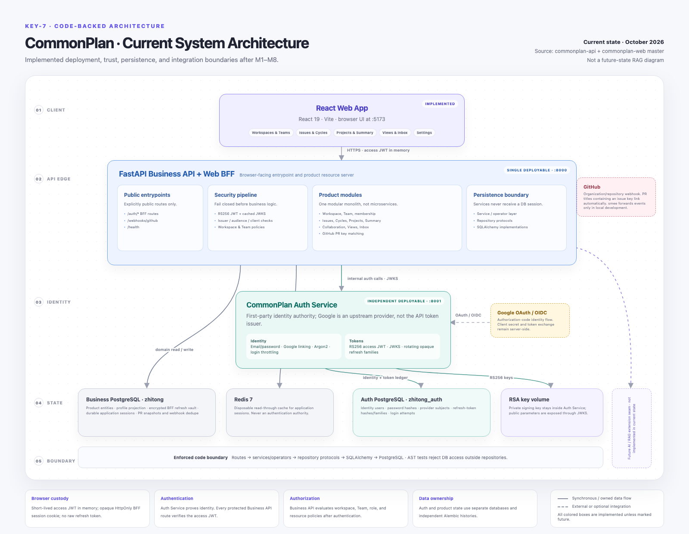

# CommonPlan current system architecture

This is the code-backed current-state architecture for KEY-7. It is intentionally different from
the attached reference design: CommonPlan does not currently deploy an API gateway, Kafka, an object
store, a vectorization worker, or an AI service. Those are potential RAG-phase components, not part of
the implemented M1–M8 runtime.

## Deployable units

| Unit | Runtime responsibility |
| --- | --- |
| React Web App | Browser UI. Keeps the short-lived access token in memory and receives only an opaque HttpOnly BFF session cookie. |
| Business API + Web BFF | One FastAPI deployable on port 8000. Owns `/auth/*` browser mediation, all protected product APIs, resource authorization, and the GitHub webhook. |
| Auth Service | Independent FastAPI deployable on port 8001. Owns credentials, Google identity linking, access-token signing, JWKS, refresh rotation, and login throttling. |

## Storage ownership

| Store | Authority |
| --- | --- |
| Business PostgreSQL (`zhitong`) | Product entities, local profile projection, browser auth-session vault, application sessions, and GitHub PR/webhook records. |
| Auth PostgreSQL (`zhitong_auth`) | Identity users, password hashes, external identities, refresh-token hash families, login codes, and login attempts. |
| Redis | Disposable read-through cache for application sessions. PostgreSQL remains the source of truth. |
| RSA key volume | Auth Service signing key material. The private key never crosses the identity boundary. |

## Trust and request flow

1. React sends login, refresh, logout, and Google-start requests to the BFF routes on port 8000.
2. The BFF calls Auth Service over its confidential internal channel. Raw refresh tokens exist only
   transiently in Auth Service and the BFF; Auth stores a hash and the BFF stores an encrypted copy.
3. React sends its short-lived access JWT directly to protected `/api/v1/*` routes.
4. The global router guard verifies RS256 signature, issuer, audience, client, token type, and time
   claims using Auth Service JWKS.
5. Resource policies then enforce workspace membership, Team membership/role, and resource ownership.
6. Services and optional operators call repository protocols. Only repository implementations access
   SQLAlchemy or PostgreSQL; architecture tests enforce this boundary.

## External integrations

- Google is an upstream OAuth/OIDC identity provider. CommonPlan Auth Service remains the credential
  issuer used by Business API.
- GitHub sends signed pull-request webhooks to Business API. PR titles are matched against issue keys
  at workspace scope without project-to-repository mapping. `smee` is a local-development transport,
  not a production component.

## Future RAG seam

The current diagram reserves an extension seam but does not claim unimplemented infrastructure.
Before adding RAG, KEY-9/10/11 should define whether ingestion, object storage, vector search, model
gateway, and async delivery become independent deployables or remain modules of the existing platform.
Any future diagram should distinguish current, proposed, and externally managed components.

The editable visual source is
[`commonplan-current-architecture.html`](commonplan-current-architecture.html). Detailed auth and
request sequences remain in [`../system-architecture.md`](../system-architecture.md).

For the recommended deployment, independent BFF, and staged RAG direction, see the
[target full-system architecture](commonplan-target-architecture.md).
