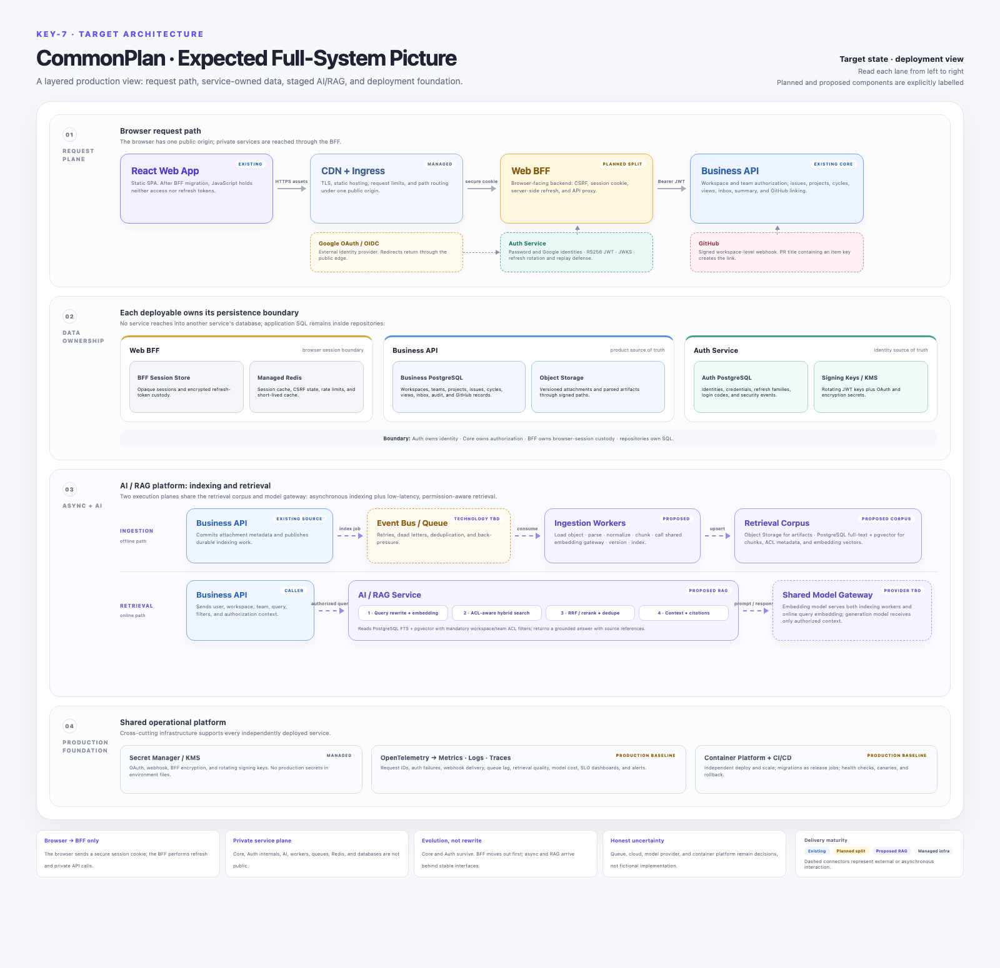

# CommonPlan target full-system architecture

This diagram is the expected production direction, not a claim about today's deployment. Each box is
tagged by delivery maturity: **Existing**, **Planned split**, **Proposed RAG**, or **Managed**.

## Recommended target decisions

### 1. Make the BFF a real independent boundary

The browser should call only the Web BFF for dynamic traffic. The BFF owns secure cookies, CSRF,
server-side refresh, and calls private Business/Auth APIs using access tokens. This removes access-token
visibility from React and resolves the current half-BFF topology where `/auth/*` uses the BFF but
business requests go directly from React to Business API.

The BFF session vault should move out of the Business API's schema into a BFF-owned schema or database.
Redis can accelerate session lookup, but the encrypted durable record should remain recoverable if
Redis is lost.

### 2. Keep Auth and product authorization separate

Auth Service continues to own identities, credentials, Google linking, access-token signing, refresh
families, and security events. Business API remains the resource server and resolves current workspace,
Team, role, and resource policy from product state. Frequently changing permissions should not be
embedded in long-lived identity tokens.

### 3. Deploy the current modular core before splitting domain services

Business API remains one deployable modular monolith. Workspace, Team, issue, cycle, project, summary,
collaboration, view, inbox, and GitHub modules do not need separate services until scaling or ownership
data proves that boundary is valuable.

### 4. Add an async foundation only when RAG ingestion needs it

The target needs durable background jobs for attachments, embeddings, retries, notifications, and
scheduled work. The diagram deliberately says **Event Bus / Job Queue (technology TBD)**. Kafka should
not be selected merely because the reference design uses it; a managed queue or Redis-backed worker
may be sufficient at initial load.

### 5. Add RAG as two deployable responsibilities

- **Ingestion & Background Workers**: consume durable index jobs; load original objects; parse,
  normalize, chunk, embed, version, and upsert full-text/vector indexes; retry idempotently.
- **AI/RAG Service**: accept an already-authorized user/workspace/team context from Business API;
  rewrite and embed the query; enforce metadata ACL filters during hybrid full-text/vector search;
  fuse results with RRF, rerank and deduplicate; assemble cited context; call the model gateway; and
  return a grounded answer with source references.
- **Shared Model Gateway**: give indexing workers and the online service one provider-neutral interface.
  Workers call its embedding model for document chunks; online retrieval calls the same compatible
  embedding model for query vectors and calls the generation model only after authorization-filtered
  context has been assembled.

The initial vector index can use `pgvector` alongside product metadata in Business PostgreSQL. Original
attachments and parsing artifacts belong in object storage. A separate vector database should be
introduced only after measured scale or retrieval requirements justify it.

Ingestion and online retrieval are intentionally separate paths. A document may be indexed again
without blocking user requests, while every online retrieval must apply workspace/team authorization
before any retrieved text is placed in a model prompt.

## Public and private routing

| Public path | Destination | Notes |
| --- | --- | --- |
| Static web assets | CDN/static hosting | Immutable builds and SPA fallback. |
| `/app/*`, `/auth/*` | Web BFF | All browser dynamic traffic and session mediation. |
| `/oauth/*` | Auth Service | Only browser redirect/callback surface required by external providers. |
| `/webhooks/github` | Business API webhook receiver | Signature, owner, delivery-id, and event validation before processing. |

Core product APIs, Auth internal token endpoints, AI/RAG, workers, databases, Redis, queues, and object
storage are private service-plane resources.

## Staged delivery

1. **Production baseline** — static hosting/CDN, ingress, managed databases/Redis, secret manager,
   migrations as release jobs, health checks, backups, and OpenTelemetry.
2. **BFF separation** — extract current auth/BFF modules, proxy all browser business calls, move the
   encrypted browser-session vault, and stop returning access tokens to JavaScript.
3. **Async and attachment foundation** — object storage, job/event abstraction, idempotent workers,
   retry/dead-letter behavior, and attachment status tracking.
4. **RAG platform** — full-text + vector indexing, ingestion workers, AI/RAG service, model gateway,
   evaluation data, feedback, security filters, and cost/latency observability.

The editable visual source is
[`commonplan-target-architecture.html`](commonplan-target-architecture.html). Compare it with the
[current-state architecture](commonplan-current-architecture.md) to see which boundaries are already
real and which require implementation.
