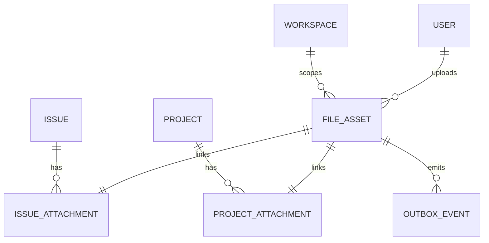

# 07 — Attachments and document foundation

## Ownership and storage boundary

PostgreSQL owns file metadata, authorization scope, and lifecycle events. A storage driver outside PostgreSQL owns the bytes: a persistent signed file volume locally and a private S3-compatible bucket in deployment. The browser never receives storage credentials: it requests a short-lived signed URL after JWT and resource authorization, uploads directly, and confirms completion through the Business API.

`issue_attachments` and `project_attachments` are explicit link tables instead of a polymorphic `owner_type/owner_id` pair, so each reference has a real foreign key. M9 creates each file for exactly one resource. Future reuse should add an explicit product rule before allowing the same asset to link to several resources.

## Upload lifecycle

1. Client sends filename, MIME type, byte size, and optional SHA-256 to the resource's `/attachments/initiate` endpoint.
2. Business API checks Team/resource access, validates type and size, creates a `pending` `file_assets` row and its resource link, and returns a 15-minute signed `PUT` URL.
3. Browser uploads the bytes to the configured storage driver using the returned headers. The local driver exposes only HMAC-signed temporary routes; the S3 driver uses native presigned URLs.
4. Client calls `/files/{fileId}/complete`; the API checks authorization again and verifies the stored object size before marking it `ready`.
5. The same transaction writes a `file.ready` outbox event. A later indexing worker can consume this event without putting extraction or embedding work on the upload request path.
6. Downloads require a new authorized request and return a short-lived signed URL. Deletion removes the object, soft-deletes metadata, and writes `file.deleted`.

### Lost upload acknowledgements

A successful storage `PUT` and its HTTP acknowledgement are separate facts: storage may persist the bytes even when the browser receives a network error or non-success response. The client therefore treats `/complete` as the source of truth instead of creating a second attachment immediately:

1. After every `PUT` attempt, including an ambiguous failure, the client calls the idempotent `/complete` endpoint.
2. If storage already contains an object of the declared size, `/complete` marks the existing asset `ready` and the upload succeeds.
3. Transient completion failures are retried against the same `fileId`; completing an already-ready asset returns that asset without emitting another `file.ready` event.
4. Only when completion confirms that the object is absent does the client retry `PUT` with the same signed URL and storage key. It does not call `/initiate` again, so this recovery path cannot create a duplicate metadata row.

This handles both a lost `PUT` response and a lost `/complete` response. Long-abandoned `pending` uploads still require the planned cleanup worker.

## API contract

- `GET/POST /api/v1/workspaces/{w}/issues/{key}/attachments[/initiate]`
- `GET/POST /api/v1/workspaces/{w}/teams/{t}/projects/{p}/attachments[/initiate]`
- `POST /api/v1/workspaces/{w}/files/{fileId}/complete`
- `GET /api/v1/workspaces/{w}/files/{fileId}/download-url`
- `DELETE /api/v1/workspaces/{w}/files/{fileId}`

Allowed types currently cover PDF, common Office documents, text/Markdown/CSV/JSON, and common web images. The default maximum is 25 MiB. Both values are server-enforced; the UI `accept` value is convenience only.

## Security and known limits

- Storage is private; public URLs are never stored. The local file directory is not mounted into the Web container or served as a static directory.
- Object keys use workspace and random file UUIDs, not user filenames.
- Every complete/download/delete operation rechecks current membership, so a removed member cannot keep minting URLs.
- Filename, MIME allowlist, declared size, stored size, and optional checksum format are validated.
- `scan_status=not_configured` is explicit. Malware scanning and byte-level MIME sniffing must be added before production rather than implied by the current implementation.
- The optional SHA-256 is persisted for future integrity/index deduplication, but the current S3 completion check cannot independently prove it. Production should use an S3 checksum header or a scanning worker that computes the digest.
